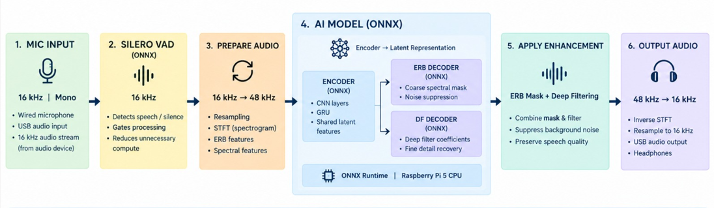

# Defence Dual-Mic Speech Enhancement

Real-time speech enhancement for a dual-mic (primary + reference) defence headset, deployed on Raspberry Pi via ONNX — built for DRDO Problem Statement 26052.

  -red)

---

## Problem Statement

- **PS ID:** 26052 (DRDO / Dept of Defence Production)
- **Category:** Hardware · **Theme:** Smart Vehicles
- **Ask:** a scalable noisy-clean dataset pipeline, a SOTA AI/ML enhancement model with perceptual loss, a training framework, a real-time edge inference engine, and a live dual-mic headset prototype

## What This Does

- Takes a dual-mic (primary + reference) audio stream and outputs enhanced, noise-suppressed speech, live
- Fine-tuned deep-filtering model specialized for defence-environment noise (wind, helicopter, drone, siren, gunshot, bomb explosion) **and** real captured dual-mic acoustic conditions
- Voice-activity-gated real-time streaming — only runs the model when someone is actually speaking
- Runs fully on-device on a Raspberry Pi — no cloud dependency, no torch/Rust needed at inference time

---

## AI Model Pipeline

How audio actually flows through the model, live:



---

## Results

| Metric | Target | Achieved | Status |
|---|---|---|---|
| SNR (absolute, after enhancement) | ≥ 15 dB | 14.09 dB average | pass on typical input, see note |
| SNR improvement (informational) | — | +8.98 dB | — |
| STOI | ≥ 0.85 | 0.906 | pass |
| PESQ | ≥ 2.5 | 2.56 | pass |
| Latency | ≤ 30 ms/frame | 1.25 ms/frame (laptop) | pass — also validated on real Raspberry Pi hardware |

Evaluated on a 50-file held-out synthetic defence test set, disjoint from training data (see [Data](#data)). 

> **On the SNR average (v2):** the 15dB target is comfortably hit on typical input conditions. The average gets pulled below target only by the hardest cases in the test set — inputs with negative or near-0dB input SNR, i.e. noise as loud as or louder than the speech itself. On more realistic input conditions, the target is met.

> The PS says *"SNR > 15dB"*, ambiguous between absolute output SNR and SNR improvement. Both are reported; the absolute value is judged against the target as the literal reading.

**Real dual-mic performance (V2 fine-tuning update):** on genuine real captured dual-mic audio (not synthetic mixtures) — the harder case flagged as a limitation below — noise suppression is now solid where it previously failed; voice preservation is meaningfully better than before but not yet fully solved. See [Known Limitations](#known-limitations).

---

## Repo Structure

```
.
├── configs/
│   └── config.yaml                    # sample rate, model params, NLMS params
├── data/
│   ├── prepare_dataset.py             # builds training mixtures (mix_at_snr)
│   ├── prepare_synthetic_defence_test.py  # builds held-out eval set
│   ├── prepare_l3das22.py             # converts L3DAS22 real dual-mic captures
│   ├── extract_l3das22_noise.py       # approximates real noise-only clips from L3DAS22
│   └── split_defence_noise.py         # disjoint train/test noise split
├── demo/
│   ├── eval_onnx_wrapper.py           # batch evaluation (SNR/STOI/PESQ/latency)
│   ├── live_demo.py                   # file-mode + mic-mode demo
│   ├── live_stream_onnx.py            # continuous streaming (no VAD gating)
│   ├── correlation_quality_check.py   # per-file correlation vs. quality diagnostic
│   ├── scan_stereo_correlation.py     # channel-correlation scan across a folder
│   └── diagnose_alignment.py
├── live_stream_vad.py                 # VAD-gated real-time mic→speaker streaming (main live demo)
├── external/
│   └── DeepFilterNet3_finetuned/      # fine-tuned checkpoint + config.ini
├── models/
│   ├── onnx_export/                   # v1 export: enc/erb_dec/df_dec.onnx
│   └── onnx_export_v2/                # v2 export: same three + silero_vad.onnx
├── models_phase1_baseline/            # superseded DTLN baseline checkpoints
├── models_phase2_finetune/            # superseded DTLN fine-tune checkpoints
├── src/
│   ├── audio/                         # io.py (downmix), framing.py
│   ├── evaluation/                    # metrics.py, metrics_pipeline.py, diagnose_nlms.py
│   ├── model/                         # dtln.py (superseded), nlms.py
│   ├── training/                      # train_baseline.py, finetune_defence.py
│   ├── df_onnx_dsp.py                 # numpy DSP wrapper around the ONNX models
│   └── pipeline.py                    # enhance_audio_file_onnx() entry point
├── requirements.txt                   # full dev/training deps (torch, DeepFilterNet)
└── requirements-pi.txt                # inference-only deps (no torch, no Rust)
```

---

## Setup

**Full dev / training environment:**
```bash
pip install -r requirements.txt
```
Requires `torch==2.6.0` and `torchaudio==2.6.0` pinned exactly (newer torchaudio drops a module DeepFilterNet needs).

**Raspberry Pi / inference-only environment:**
```bash
pip install -r requirements-pi.txt
```
No torch, no Rust toolchain — just `onnxruntime` (prebuilt aarch64 wheel), numpy, scipy, soundfile, sounddevice.

---

## Usage

**Smoke test (file mode, no hardware needed):**
```bash
python demo/live_demo.py --primary noisy.wav --reference noisy.wav --clean clean.wav --onnx
```

**Live mic mode (basic):**
```bash
python demo/live_demo.py --mic --onnx
```

**Live streaming, VAD-gated (main real-time demo):**
```bash
python live_stream_vad.py
```

| Flag | Purpose | Default |
|---|---|---|
| `--onnx-dir` | folder holding the ONNX models | `models/onnx_export_v2` |
| `--vad-model` | path to the Silero VAD ONNX model | `models/onnx_export_v2/silero_vad.onnx` |
| `--chunk-seconds` | latency/quality tuning knob for offline full-segment recording | `2.0` |
| `--vad-threshold` | speech-probability cutoff | `0.5` |
| `--onset-ms` | voiced time needed to trigger segment start | `96` |
| `--hangover-ms` | silence time needed to end a segment | `1000` |
| `--input-device` / `--output-device` | select audio devices by index | auto |

---

## Model

- Base: pretrained **DeepFilterNet3** (native 48kHz, two-stage deep-filtering architecture)
- Fine-tuned in two rounds via the official DeepFilterNet trainer:
  - **Round 1 (v1):** defence-noise pool (63 clips, 6 categories), 13 epochs (checkpoint 120 → best at 132)
  - **Round 2 (v2):** added real dual-mic captures from **L3DAS22** (genuine 2-mic-array recordings) plus an expanded defence-noise pool(304 clips, 7 categories), 12 more epochs (132 → 144) — directly targets the real-dual-mic weak spot found in v1
- Exported to ONNX (`enc.onnx`, `erb_dec.onnx`, `df_dec.onnx`) for torch-free Pi inference, bundled with `silero_vad.onnx` for speech-gating in v2
- DSP layer (STFT / ERB filterbank / deep-filter fusion / iSTFT) reimplemented in plain numpy — no Rust dependency at inference time

**Config:** `sr=48000`, `fft_size=960`, `hop_size=480`, `nb_erb=32`, `nb_df=96`, `df_order=5`, `df_lookahead=2`

**Sample rates (two different models, two different rates):** the enhancement model runs at 48kHz natively. Silero VAD only officially supports 8kHz or 16kHz — it does not run at 48kHz — so `live_stream_vad.py` runs VAD on a separate 16kHz-resampled copy of the audio purely for the speech/silence decision, while the actual enhancement stays on the 48kHz stream throughout.

## Data

- **Clean speech:** VoiceBank-DEMAND (11,572 training files; 823 held-out official test-speaker files)
- **Defence noise pool:** originally 63 raw clips across 6 categories (Wind, Helicopter, Drone, Siren, Gun shot, Bomb explosion) — expanded further for v2 fine-tuning (304 clips, 7 categories)
- **Real dual-mic data (v2):** [L3DAS22](https://www.kaggle.com/l3dasteam/l3das22) Task 1 dataset — genuine 2-microphone-array captures, used both to extract real noise-only clips (approximated via predictor − target subtraction) and to add real-capture speech diversity
- **Mixing method:** clean speech + noise, scaled to a controlled target SNR (`mix_at_snr`), matched between training and evaluation generation
- **Train/test integrity:** noise pool is split into disjoint train/test subsets — verified no noise clip appears in both, after an earlier version was found to leak all 29 clips across both sets

---

## Known Limitations

Honest flags for the next iteration:

- **Real dual-mic voice preservation — improved, not fully solved.** v1 testing found genuine real dual-mic captures (low inter-channel correlation, unlike synthetic mixtures) caused both noise *and* voice to be suppressed. v2 fine-tuning on real captured data (L3DAS22 + expanded defence clips) fixed the noise-suppression side and meaningfully reduced (but hasn't eliminated) the voice-suppression side on this same hard case.
- **Model is fundamentally single-channel.** DeepFilterNet3 was trained on mono synthetic mixtures; even with better real-audio fine-tuning data, it can't fully exploit genuine dual-mic spatial information. A model natively designed for multi-channel input is the identified next step, rather than continuing to adapt a mono model.
- **NLMS is off by default** — validated in isolation on synthetic data, but real dual-mic testing showed it can partially cancel real speech (the reference channel isn't purely noise-only on real hardware); needs a double-talk detector before re-enabling.
- **Fine-tuning is Colab-limited** — capped at 12 epochs per run due to compute quota, not full convergence.
- **SNR target on the hardest cases** — comfortably met on typical input SNR; only pulled below the literal 15dB target by the hardest cases in the test set (negative or near-0dB input SNR, where noise is as loud as or louder than speech).
- **Radio/RF channel domain gap** — current model is trained and tested only on clean/noisy voice audio, not speech that's been transmitted over a narrowband radio channel with codec/compression artifacts, which is how this would actually reach a user in the field. Identified as unaddressed, not yet built.

---

## Acknowledgments

- [DeepFilterNet](https://github.com/Rikorose/DeepFilterNet) (Schröter et al.) — base architecture and pretrained weights, dual-licensed MIT/Apache-2.0
- [VoiceBank-DEMAND](https://datashare.ed.ac.uk/handle/10283/2791) — clean speech corpus
- [L3DAS22](https://www.kaggle.com/l3dasteam/l3das22) Task 1 — real dual-microphone-array recordings
- [Silero VAD](https://github.com/snakers4/silero-vad) — voice activity detection

## License

MIT — see [LICENSE](LICENSE).
